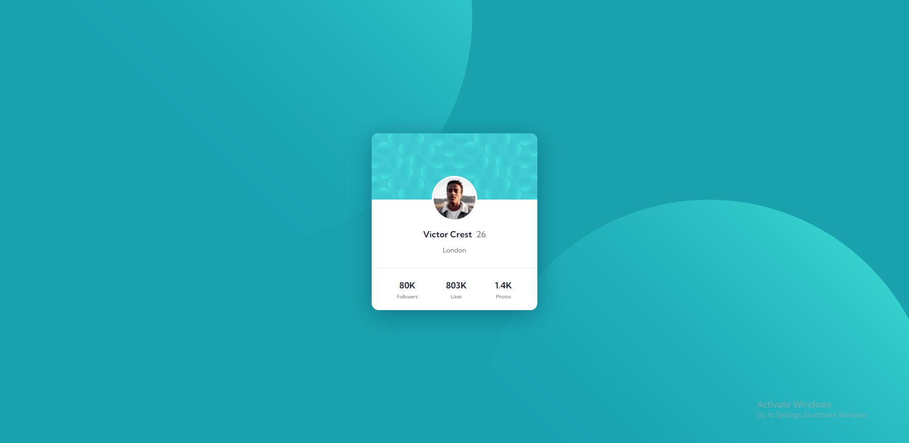

# Frontend Mentor - Profile card component solution

This is a solution to the [Profile card component challenge on Frontend Mentor](https://www.frontendmentor.io/challenges/profile-card-component-cfArpWshJ).

## Table of contents

- [Overview](#overview)
  - [The challenge](#the-challenge)
  - [Screenshot](#screenshot)
- [My process](#my-process)
  - [Built with](#built-with)

## Overview

### The challenge

Our challenge was to build out this profile card component using any tools, and get it looking as close to the design as possible;
-Desktop version

### Screenshot

## My process

The card is styled with CSS. I tried positioning background as given in the design.

### Built with

- Semantic HTML5 markup
- CSS
- Flexbox
## URL
https://profile-cardcomponent-t.netlify.app/
